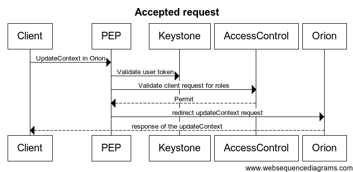
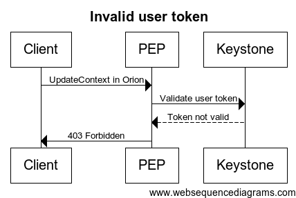
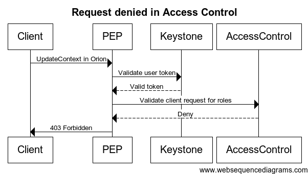
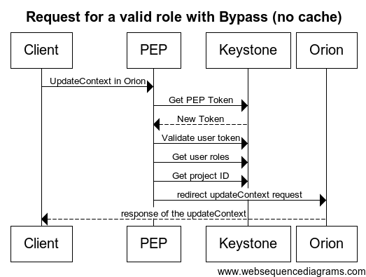

# PEP Proxy Architecture

This document explains with greater detail the architecture where the PEP Proxy is inserted.

## <a name="architecture"/> Architecture Description
Orion Policy Enforcement Point Proxy is part of the authorization mechanism of the FIWARE platform. This authorization mechanism is based in OAuth 2.0, and it makes use of tokens to identify the user.

Each request to a component holds some extra information (apart from the token) that can be used to identify what kind of action is requested to be executed and over what entity. This information may be explicit (using headers) or implicit (being part of the payload or the URL). The first task of the proxy is to extract this information; the way of extracting it depends on the particular component that it's being proxied (currently there are four plugins, supporing Orion Context Broker, Perseo Complex Event Processing and Keypass PAP API, as well as a generic REST one).

For each request, the proxy asks the IDM to validate the access token of the user (2). If the token is valid, the IDM answer with a response that contain the user roles (3). With those roles, the selected actions and resources (identified by the extra information) the PEP Proxy makes a request to the Access Manager for validation (4). This is an HTTP request using the XACML Request format. The Access Control component validates all the information and checks the retrieved data against the XACML Access Rules defined in the Identity Manager (4) (where each role for each user is associated with n permissions, each one of them defined using an XACML Rule).

Actions (2) and (3) may actually involve some more calls in the case of Keystone, in order to resolve organization names or user information, and in order to retrieve the PEP's own authoerization token. All this calls are not depicted in the diagram as they can be safely cached (the cache being configurable in the config file).

If the user is allowed to execute the requested action (5), the HTTP request is resend to the component (6); if it is not, it is rejected.

There is a special flow allowed for service administrators, that can be configured in the config file. A service administrator role ID can be configured in the `bypassRoleId` attribute, so that any request coming into the PEP Proxy with an authorization token belonging to a user with that role will not be validated against the Access Control server, but will be automatically proxied insted. A flag is also provided in the configuration to enable and disable this mechanism for the proxy (`bypass`).

## Sequence Diagramas

### Accepted request (without cache)
")

### Accepted request (with cache)

### Request rejected due to an invalid user token

### Request denied by the Access Control component

### Valid request for a role with the Bypass option

